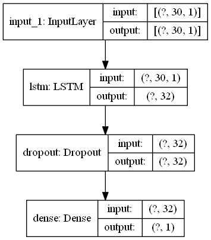
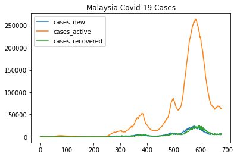
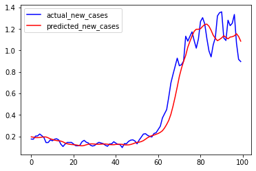

# Malaysia_Covid19_Cases_Prediction

<h3 align="left">Languages and Tools:</h3>

      

**Description** : Malaysia active Covid-19 cases dataset from CPRC from year 2020 to 2022

**Algorithm Model** : Deep Learning method->> LSTM

**Preprocessing step** : Use Pandas Interpolate to impute NaN value inside cases_new column

**Objectives** : 
1) To predict future new cases by learning 30 days past dataset
2) To achieve MAPE error lesser than 1% when testing deployment

**Flowchart Model** :

 

### Exploratory Data Analysis (EDA)
1) Data Loading
2) Data Inspection
3) Data Cleaning
4) Features Selection
5) Pre-Processing
6) Model Development (LSTM)
7) Model Evaluation

**Model evaluation** :

`LSTM`
`MSE`
`MAPE`
`MAE`
`pickle`
`EDA`

**Discussion** :

 🟠The dataset is started by loading dataset from raw websites, EDA techniques to inspect duplicated,Null values insdie dataset
 
 🟠Cleaning the dataset by checking NaN value inside each column, inside cases_new has ? symbol to impute with Nan
 
 🟠Dtype for cases_new to change into numeric float by using pandas to numeric
 
 🟠From plotting, it shows cases new and cases recovered are in a well trend,meanwhile cases active has a increasing and decreasing trend (not fixed trend)
 
  
 
 🟠Data cleaning by using interpolate to impute NaNs value
 
 🟠Preprocessing minmaxscaler for cases_new, no other features are selected since we want to predict cases_new in the future
 
 🟠LSTM model introduced with tensorboard callback,win_size is set to 30 days
 
 🟠Model evaluation is conducted and fomr the loss plotting it is looks balanced rather than MAPE, maybe we need to increase the number of epochs
 
 🟠Test model analysis is deployed by using test_case data according to training model DL(LSTM)
 
 🟠After testing, prediction is visualised and from plotting, the predicted is able to follow the trend fomr the actual cases
 
 🟠They are not really flunctuate and still able to predict since they have high MAPE
 
  
 
 
 **Conclusion** :
 
🗡️ From my result, mape inverse value is the same as sir formula after x100% 

🗡️ Meaning my MAPE is low than 1% as here shows the MAPE is 0.14%

🗡️ From the model training and results, it can concludes that this model able to predict new cases in future

🗡️ Nevertheless, maybe can try to increase number of epochs to shrink the MAPE value, minimise number of dropout rate

🗡️ For improvement, can include a web scraping algorithm to analyse the latest news to polish up the model performance
 
**Dataset** :

[Datasets_github](https://github.com/MoH-Malaysia/covid19-public)

**Credits** : 

[Credit to Ministry of Health](https://github.com/MoH-Malaysia)

<h3 align="left">Connect with me:</h3>

www.linkedin.com/in/omarhaziq

**Enjoy Coding!** 🚀
